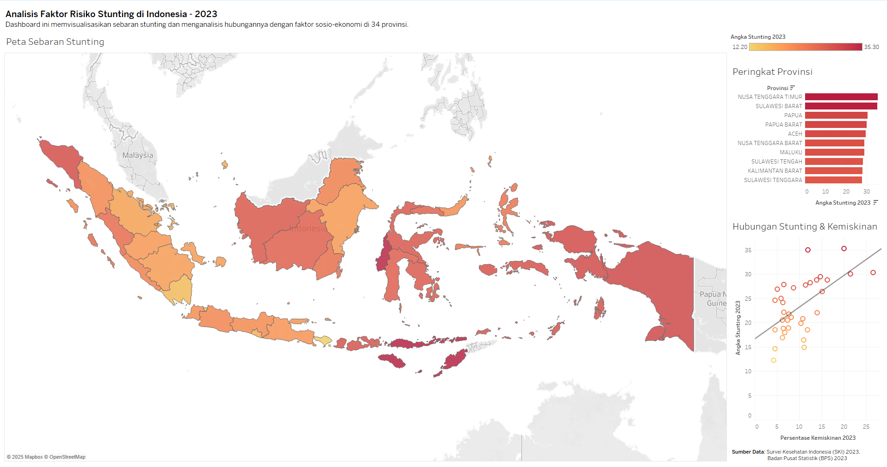

# Analisis Faktor Risiko Stunting di Indonesia (2023)

### **➡️ [Lihat Dashboard Interaktif di Tableau Public](https://public.tableau.com/app/profile/rafi.sembiring/viz/AnalisaFaktorRisikoStuntingdiIndonesia2023/DashboardStuntingIndonesia2023)**

---

## **Latar Belakang Proyek**

Proyek ini dibuat sebagai studi kasus untuk menganalisis masalah stunting yang menjadi tantangan kesehatan publik di Indonesia. Tujuannya adalah untuk mengidentifikasi faktor-faktor sosio-ekonomi yang memiliki korelasi kuat dengan prevalensi stunting di 34 provinsi, dan menyajikan temuannya dalam bentuk visual yang mudah dipahami.

---

## **Alur Kerja Proyek**

1.  **Pengumpulan Data:** Mengumpulkan data prevalensi stunting dari Survei Kesehatan Indonesia (SKI) 2023 dan data sosio-ekonomi dari Badan Pusat Statistik (BPS).
2.  **Pembersihan & Penggabungan Data:** Membersihkan dan menggabungkan beberapa dataset menjadi satu file master yang siap dianalisis.
3.  **Analisis Data Eksplorasi (EDA):** Melakukan analisis korelasi untuk menemukan hubungan antar variabel menggunakan Python di Google Colab.
4.  **Visualisasi Data & Dashboarding:** Membangun dashboard interaktif di Tableau Public untuk memvisualisasikan temuan kunci dan menceritakan "kisah" di balik data.

---

## **Teknologi yang Digunakan**

* **Analisis Data:** Python (Pandas, Matplotlib, Seaborn)
* **Lingkungan Kerja:** Google Colab
* **Visualisasi & Dashboard:** Tableau Public

---

## **Temuan Utama**

* **Korelasi Positif Kuat:** Ditemukan korelasi positif yang kuat antara **persentase kemiskinan** dengan angka stunting.
* **Korelasi Negatif Kuat:** Akses terhadap **sanitasi layak** dan **akses internet** menunjukkan korelasi negatif yang kuat dengan angka stunting.
* **Provinsi Prioritas:** Provinsi di wilayah Timur Indonesia seperti **Nusa Tenggara Timur** dan **Sulawesi Barat** menunjukkan angka prevalensi stunting tertinggi.

---

## **Cara Menjalankan Proyek**

1.  **Dataset:** Dataset bersih yang digunakan untuk analisis dan visualisasi dapat ditemukan di folder `/data`.
2.  **Notebook:** Seluruh proses analisis data dapat dilihat pada notebook `analisis_stunting.ipynb` di folder `/notebooks`. GitHub secara otomatis me-render file `.ipynb` sehingga dapat dibaca langsung di browser.
